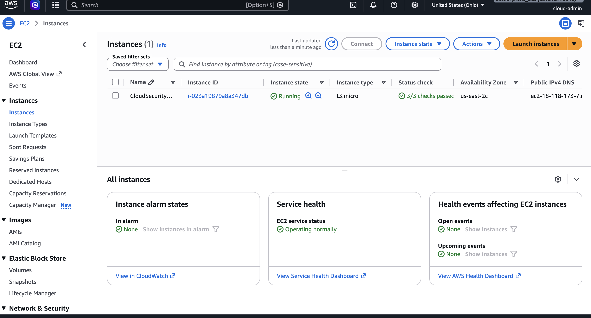
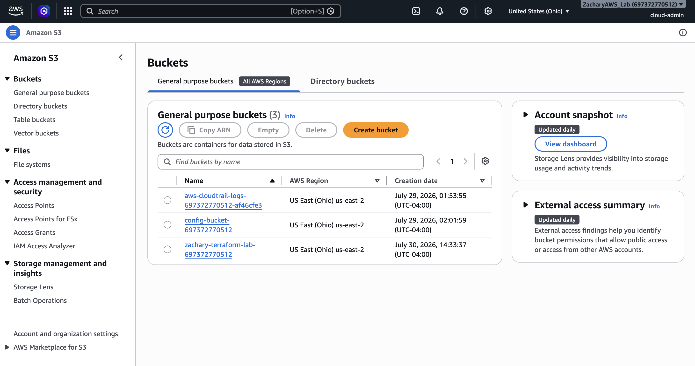
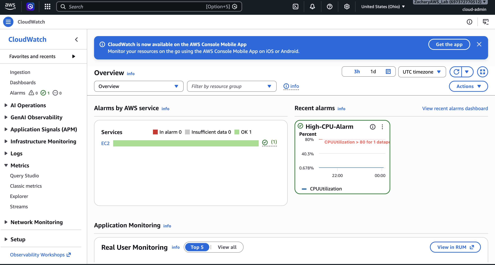
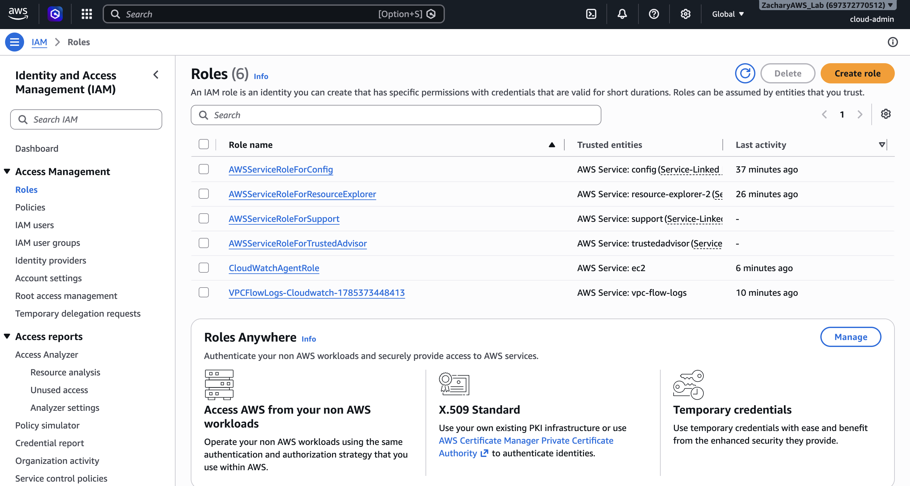

# AWS Enterprise Cloud Security Platform

## Overview

This project demonstrates how to deploy and manage secure AWS infrastructure using Infrastructure as Code (Terraform). The environment was built in a personal AWS account and follows security best practices including S3 encryption, versioning, and public access blocking.

## Project Goals

- Build secure AWS infrastructure
- Learn Infrastructure as Code (Terraform)
- Implement AWS security best practices
- Version control infrastructure with Git and GitHub

## Technologies Used

- AWS
- Terraform
- Git
- GitHub
- Amazon S3
- IAM
- CloudShell

## 📸 AWS Resources

These screenshots show the AWS resources deployed and configured as part of this cloud security lab.

### Amazon EC2 Instance


- Amazon Linux 2023 EC2 instance
- CloudWatch Agent installed
- Running in the AWS Free Tier

### Amazon S3 Buckets


- CloudTrail log storage
- Terraform state storage
- Versioning and encryption enabled
- Public access blocked

### CloudWatch Monitoring


- CloudWatch metrics
- CPU monitoring
- CloudWatch alarms
- Performance visibility

### IAM Roles


- Least privilege access
- EC2 IAM role
- CloudWatch Agent role
- Service-linked roles

## Security Features

- S3 Server-Side Encryption (AES-256)
- S3 Versioning
- S3 Public Access Block
- Infrastructure managed with Terraform
- Version controlled with GitHub

## Project Structure

```text
terraform/
├── main.tf
├── variables.tf
└── outputs.tf
```

## Skills Demonstrated

- AWS Cloud Security
- Infrastructure as Code (IaC)
- Terraform
- Cloud Infrastructure Deployment
- Git Version Control
- Secure AWS Configuration

## Future Improvements

- VPC
- EC2
- CloudWatch
- IAM Roles
- Security Groups
- VPC Flow Logs
- AWS Config
- GuardDuty
- Security Hub

## Author

**Zachary Reviere**

Computer Science | Cloud Security | AWS | Terraform
